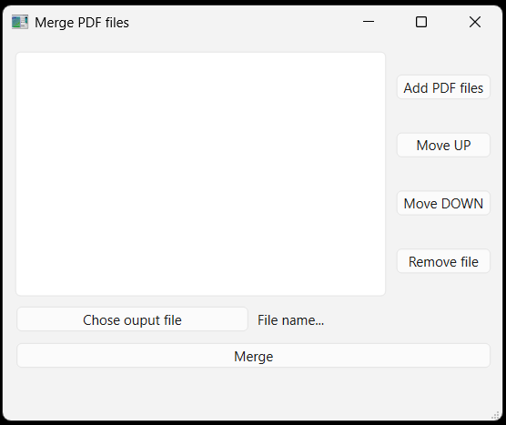

# PDF Merge utility

## Description
A small but robust PDF merging utility built with **PySide6** and **pypdf**.

It allows you to:

- Select multiple PDF files to merge
- Reorder or remove files before merging
- Choose an output file with full filesystem validation
- Safely handle permissions, corrupted PDFs, and edge cases

## Screenshot


## Requirements

- Python 3.10+
- PySide6
- pypdf

## Features

### Input Validation
- Ensures .pdf extension
- Checks PDF header signature (%PDF-)
- Verifies file is readable (parse check with PdfReader)
- Avoids duplicates in the merge list
- Handles permission errors gracefully

### Output Validation
- Ensures .pdf extension automatically
- Verifies directory exists and is writable
- Prevents accidental overwrites at merge time

### File Management in UI
- Move files up/down in the list
- Remove files from the list
- Keeps internal state and UI consistent

### Merge Functionality
- Uses merge_pdfs service to combine PDFs
- Handles exceptions: file not found, corrupted files, validation errors
- Confirms success with a message


## Edge Cases Covered
- Input file renamed with wrong extension
- Corrupted or unreadable PDF
- No read permission on input files
- Output directory doesn’t exist
- Output directory not writable
- Accidental overwrite of existing output file after reordering/removing inputs


## Installation
1. Clone the repository or create a local copy of the project 
2. Install dependencies
```bash
pip install -r requirements.txt
```
The `requirements.txt` file should include:
```text
PySide6
pypdf
```


## Usage
1. Launch the application
```bash
python main.py
```
2. Click **Add Files** to select PDFs.
3. Reorder or remove files if needed.
4. Click **Output** to choose the output PDF file.
5. Click **Merge** to combine PDFs.


## Application Workflow
```text
┌─────────────────────┐
│  User selects PDFs  │
└─────────┬───────────┘
          │
          ▼
┌────────────────────────────┐
│ Validate each input file   │
│ - .pdf extension           │
│ - %PDF- header check       │
│ - Read permission          │
│ - Parse with PdfReader     │
└─────────┬──────────────────┘
          │
          ▼
┌────────────────────────────┐
│ Add to internal file list  │
│ (No duplicates)            │
└─────────┬──────────────────┘
          │
          ▼
┌────────────────────────────┐
│ User selects output file   │
└─────────┬──────────────────┘
          │
          ▼
┌────────────────────────────┐
│ Validate output path       │
│ - Ensure .pdf extension    │
│ - Directory exists         │
│ - Write permission check   │
└─────────┬──────────────────┘
          │
          ▼
┌────────────────────────────┐
│ Merge button clicked       │
└─────────┬──────────────────┘
          │
          ▼
┌────────────────────────────┐
│ Overwrite protection       │
│ (if file already exists)   │
└─────────┬──────────────────┘
          │
          ▼
┌────────────────────────────┐
│ Call merge_pdfs service    │
│ Handle exceptions safely   │
└─────────┬──────────────────┘
          │
          ▼
┌─────────────────────┐
│ Success message     │
└─────────────────────┘
```

## Project Structure
```text
pdf_merge/
├── main.py                 # MainWindow class with UI logic and validation
├── ui/                     # Generated UI code from Qt Designer
│   ├── mainwindow.py       # MainWindow class with UI logic and validation
│   ├── ui_mainwindow.py    # Qt Designer Compiled code
│   └── mainwindow.ui       # MainWindow Qt Designer code
├── services/
│   └── pdf_merger.py       # Service to merge PDFs
├── utils/
│   └── paths.py            # Path utilities
└── requirements.txt
```


## License

This project is licensed under the MIT License.
See the `LICENSE` file for full details.